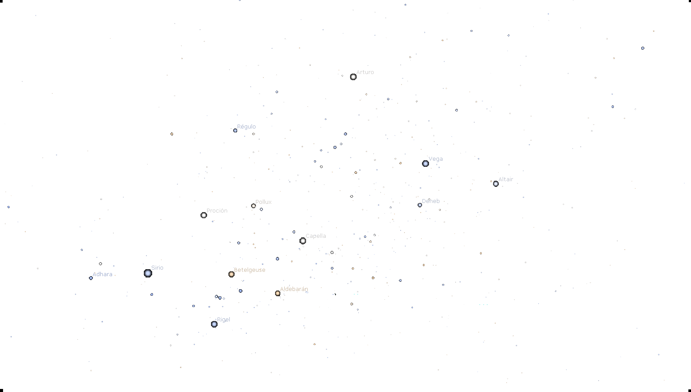
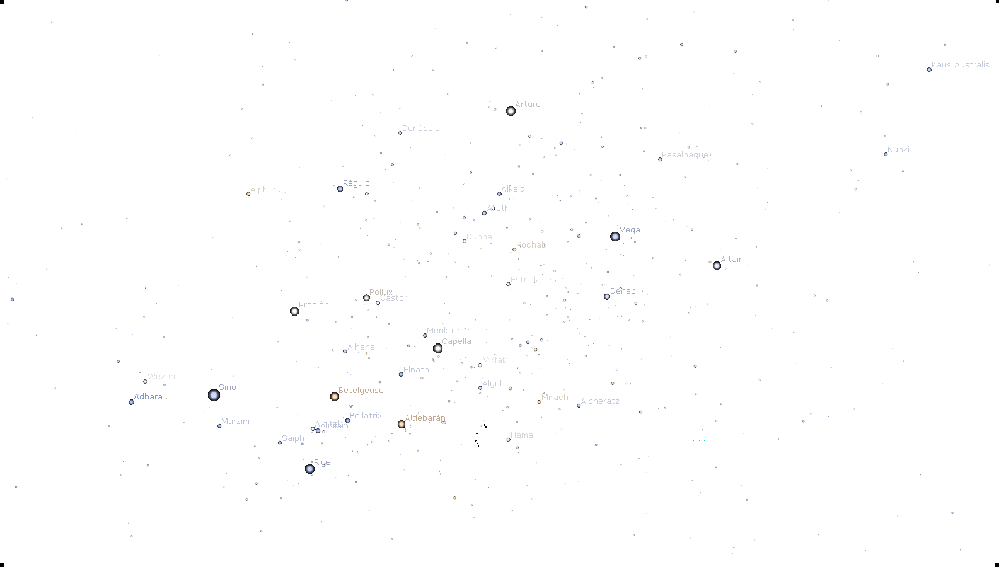
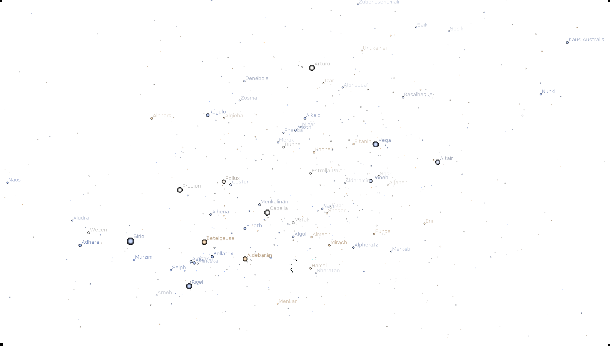
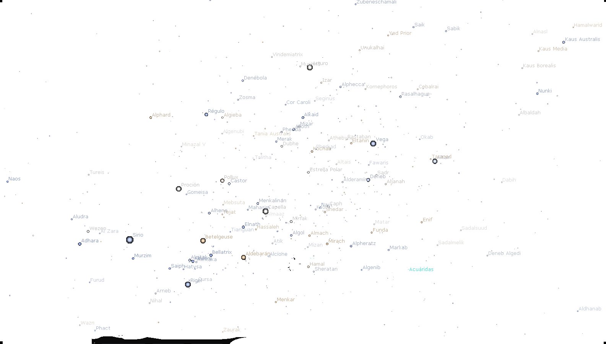
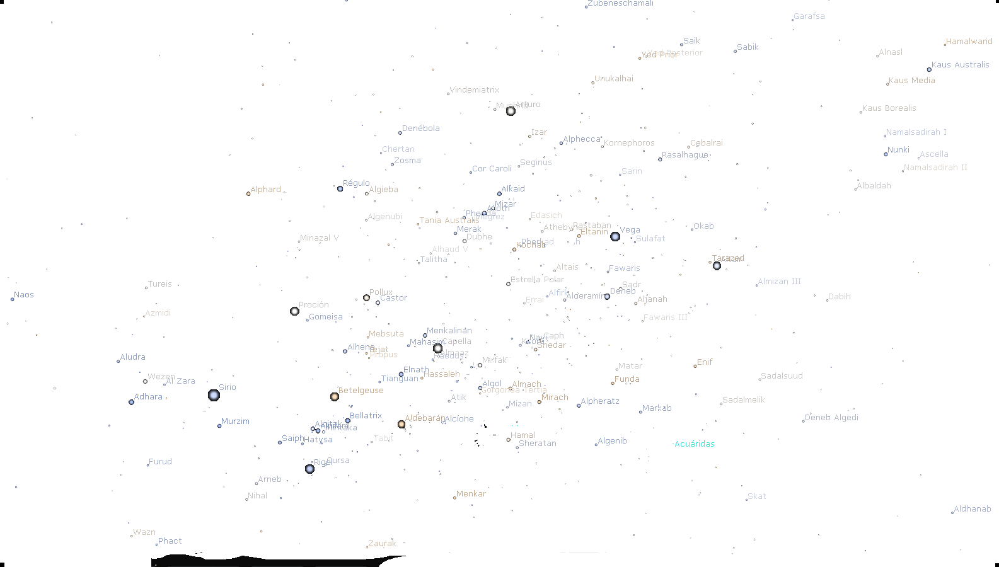
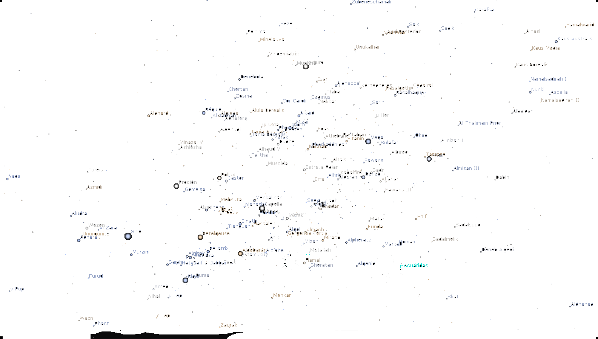
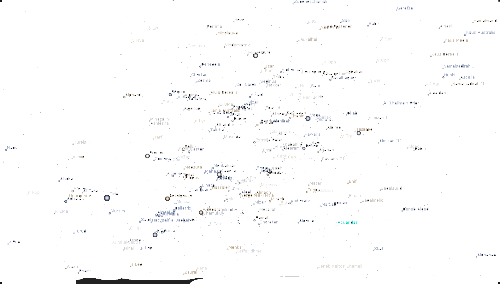
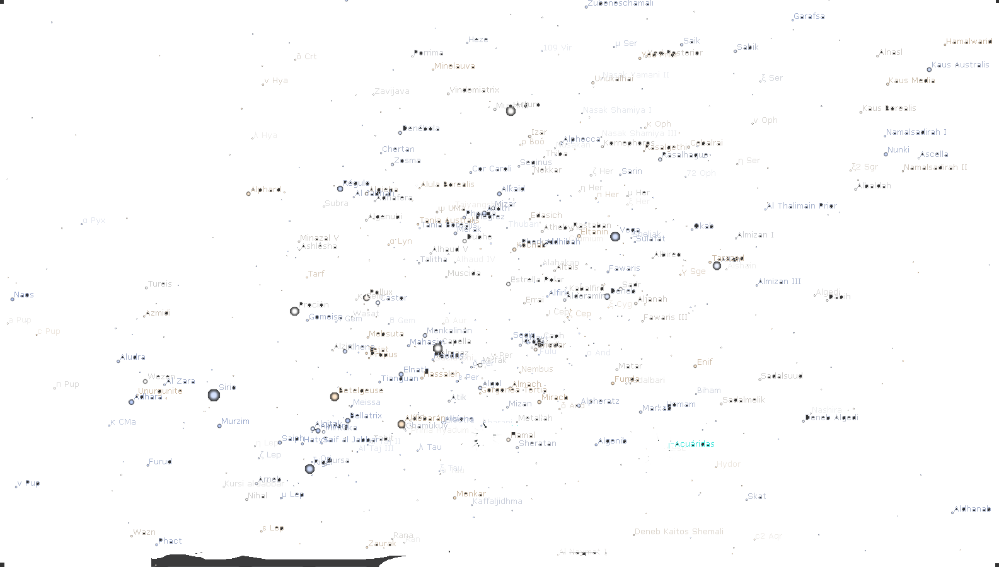
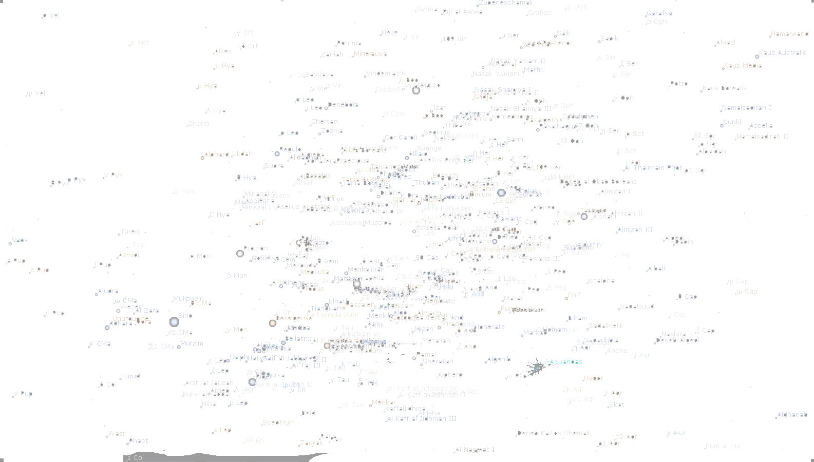
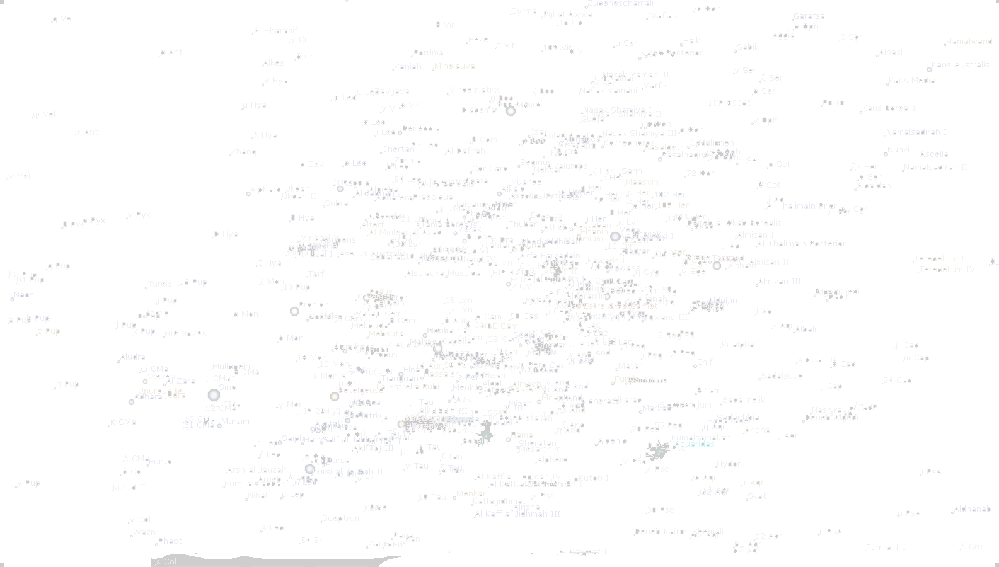

°º¤ø,¸¸,ø¤º°`°º¤ø,¸,ø¤°º¤ø,¸¸,ø¤º°`°º¤ø,¸¸,ø¤º°`°º¤ø,¸,ø¤°º¤ø,¸¸,ø¤º°`°º¤ø,¸

°º¤ø,¸¸,ø¤º°`°º¤ø,¸,ø¤°º¤ø,¸¸,ø¤º°`°º¤ø,¸,ø¤º°`°º¤ø,¸,ø¤°º¤ø,¸¸,ø¤º°`°º¤ø,¸

roseta introduccion1               index.html       
zoom                               zoom.html
roseta crop salida                 rosetacropsalida.html
 ** activar roseta                 activarroseta.html      
constelacion de palabras           constelacion.html       

ANGULAR.JS MINIFIED EN EL FOLDER JS

°º¤ø,¸¸,ø¤º°`°º¤ø,¸,ø¤°º¤ø,¸¸,ø¤º°`°º¤ø,¸°º¤ø,¸¸,ø¤º°`°º¤ø,¸,ø¤°º¤ø,¸¸,ø¤º°`°º¤ø,¸

**********************************************************************************

Roseta introduccion1  
archivo: index.html

liga a css  
<link rel="stylesheet" href="./css/style001.css">
liga a js

Recursos img
  
https://i.postimg.cc/gjJDHXQJ/transparente.png"  ./img/transparente.png
https://i.imgur.com/t0cN8bJ.png"  ./img/index01.png-->
https://i.imgur.com/pAcL8nC.png"  ./img/index02.png-->
https://i.imgur.com/oUupEOz.png"  ./img/index03.png-->
https://i.imgur.com/VwEchxP.png"  ./img/index04.png-->
https://i.imgur.com/EjFzUwL.png"  ./img/index05.png-->
https://i.imgur.com/83R0UXC.png"  ./img/index06.png--> 
https://i.imgur.com/nTPVO1F.png"  ./img/index07.png-->
https://i.imgur.com/8BE5v8T.png"  ./img/index08.png-->
https://i.imgur.com/qJCK8gU.png"  ./img/index09.png-->
https://i.imgur.com/kRGinh0.png"  ./img/index10.png-->
https://i.imgur.com/MJA9OXM.png"  ./img/index11.png-->

°º¤ø,¸¸,ø¤º°`°º¤ø,¸,ø¤°º¤ø,¸¸,ø¤º°`°º¤ø,¸

ZOOM
archivo: zoom.html

Liga a css
<link rel="stylesheet" href="./css/zoom.css">
liga a js

°º¤ø,¸¸,ø¤º°`°º¤ø,¸,ø¤°º¤ø,¸¸,ø¤º°`°º¤ø,¸

ROSETA 
Archivo: rosetaccropsalida.html

Liga a css
<link rel="stylesheet" href="./css/style001.css">
Liga a js

°º¤ø,¸¸,ø¤º°`°º¤ø,¸,ø¤°º¤ø,¸¸,ø¤º°`°º¤ø,¸

Constelacion de palabras

Archivo:
constelacion.html
liga a css
<link rel="stylesheet" href="./css/constelaciondepalabras.css">
js no tiene archiv separado

ANGULAR:
https://ajax.googleapis.com/ajax/libs/angularjs/1.6.9/angular.min.js

JSON:
En esta version los datos usados estan directos en el codigo javascript.

°º¤ø,¸¸,ø¤º°`°º¤ø,¸,ø¤°º¤ø,¸¸,ø¤º°`°º¤ø,¸

Activar roseta
archivo:
activarroseta.html

liga a css
<link rel="stylesheet" href="./css/activarroseta.css">
liga a js

  
Recursos 
imagenes

   

  
  
  
  
  
  
  
  
  
  
  

Aloha Mundo! JGeekPi
=================
-------------------

\ ゜o゜)ノ
